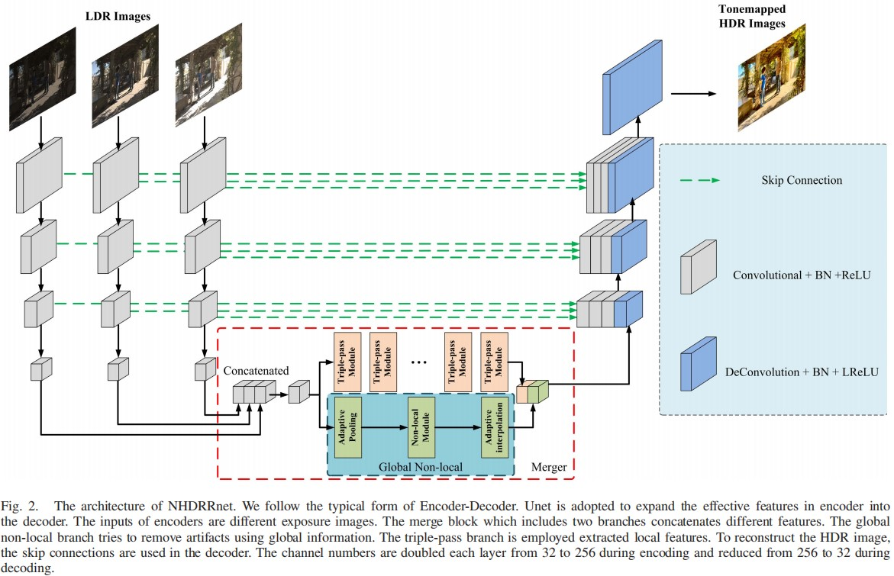

# NHDRRNet-PyTorch
- This is the PyTorch implementation of [Deep HDR Imaging via A Non-Local Network](https://ieeexplore.ieee.org/stamp/stamp.jsp?tp=&arnumber=8989959) (TIP 2020).



## 0. Differences between Original Paper and this Repository
- The mu-PSNR value in the paper is **42.4143 dB**, in this PyTorch implementation version, the mu-PSNR value is **43.1572 dB**.
- In the training process, data augmentation is not implemented in the repository.
- In the training process, the original paper trained the model for 160,000 epochs and adjust the learning rate for every 20,000 epochs after 80,000 epochs. While in the repository, the mu-PSNR value reached **43.1572 dB** after around 6000 epochs and the learning rate is adjusted every 20,000 epochs.

## 1. Environment
- Python >= 3.7
- PyTorch >= 1.4.0
- opencv-python = 4.5.1
- imageio = 2.13.3
- matplotlib

## 2. Dataset
The training data and testing data is from [Kalantari](https://people.engr.tamu.edu/nimak/Data/SIGGRAPH17_HDR_LoRes.pdf) (ACM TOG 2017), the dataset can be downloaded from [Kalantari Dataset](https://cseweb.ucsd.edu/~viscomp/projects/SIG17HDR/).

## 3. Quick Demo (Only for tiff format 48-depth images (same with the Kalantari Dataset) now, others in progress)
1. Clone this repository:
    ```
    git clone https://github.com/ytZhang99/NHDRRNet-PyTorch.git
    ```
2. Download the trained model from [Baidu Netdisk](https://pan.baidu.com/s/1x_GRQyzuSSJfxUH3kUc9cg) , Access Code: [pho5]. Place the model under ```./ckp``` .
3. Place the test image folders in `./data/Test/`:
    ```
    Test
    └── test_data
        ├── Name_A
        |   ├── 1.tif
        |   ├── 2.tif
        |   ├── 3.tif
        |   ├── exposure.txt
        |   └── HDRImg.hdr (optional)
        └── Name_B
    ```
4. Run the following command to test :
    ```
    python main.py --test_only
    ```
    The output images are placed in `./results/0_epoch/`

## 4. Training
1. Place the training image folders in `./data/Train/`:
    ```
    Train
    └── train_data
        ├── Name_A
        |   ├── 1.tif
        |   ├── 2.tif
        |   ├── 3.tif
        |   ├── exposure.txt
        |   └── HDRImg.hdr
        └── Name_B
    ```
2. Modify the `main.sh` file and run the following command to train :
    ```
    sh main.sh
    ```
    Notice that the default setting of this program is implementing validation on the test dataset after training, you can modify `main.sh` to close the validation progress.
3. The trained model is saved in `./ckp/`, then you can test your own model :
    ```
    python main.py --test_only --model latest.pth
    python main.py --test_only --model best_checkpoint.pth (This model is accessible with validation)